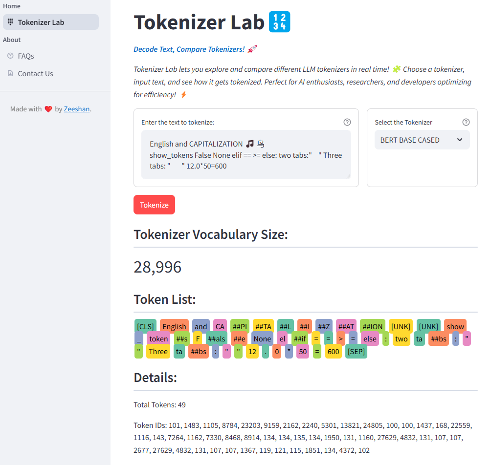
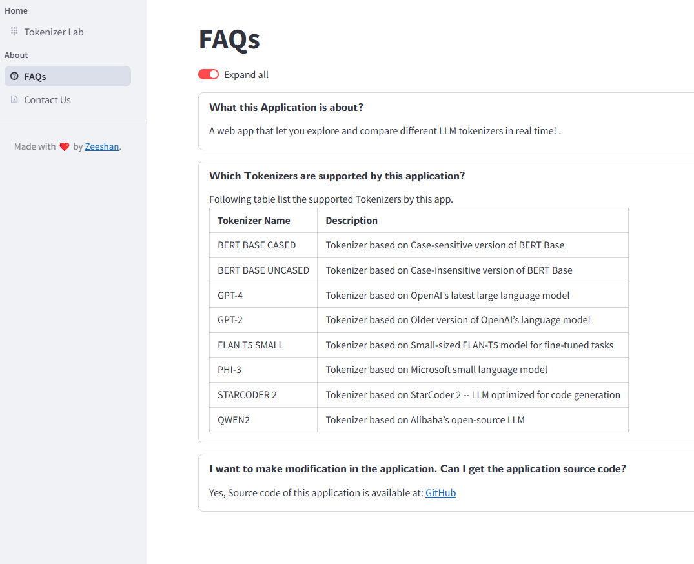

# Tokenizer Lab 🔢
Decode Text, Compare Tokenizers! 🚀

okenizer Lab lets you explore and compare different LLM tokenizers in real time! 🧩 Choose a tokenizer, input text, 
and see how it gets tokenized. Perfect for AI enthusiasts, researchers, and developers optimizing for efficiency! ⚡

# Application Link
https://llm-tokenizer.streamlit.app/

# Technologies Used
* streamlit -- Front end development
* transformers -- Hugging Face transformers package for SOTA pretrained models
   
# System Requirements
You must have Python 3.11 or later installed.

# Installation
1.  Clone this repository
2. Create a virtual environment
3. Install the necessary python packages:
   `pip install -r requirements.txt`
4. Run the application with following command from terminal:

   `streamlit run app.py`

# Screen Shots

